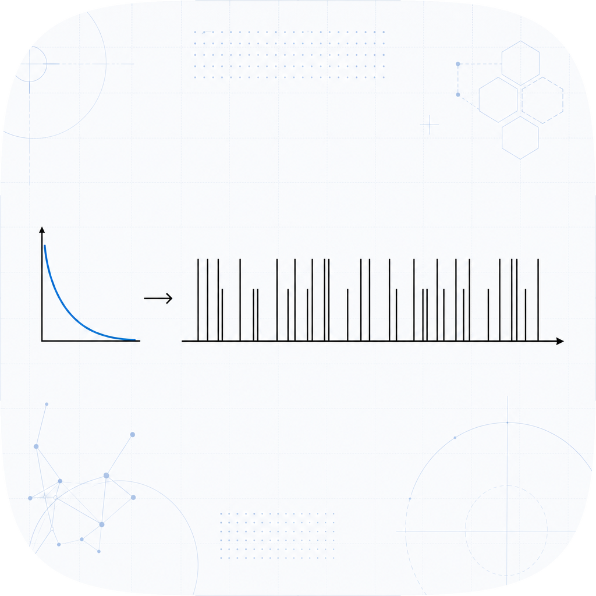

# spikegen

<p align="center">
  
</p>

[](https://pypi.org/project/spikegen/)
[](https://github.com/amaar-mc/spikegen/actions/workflows/ci.yml)
[](./LICENSE)

Generate spike trains in pure Python with zero dependencies. Poisson, gamma and inverse-Gaussian renewal, regular, Bernoulli, and inhomogeneous processes, returned as plain sorted lists of spike times, with explicit seeds for reproducibility.

## Install

```sh
pip install spikegen
```

## 30-second example

```python
from spikegen import homogeneous_poisson, regular, gamma_renewal, with_refractory

homogeneous_poisson(rate=50.0, duration=2.0, seed=0)   # Poisson spikes in [0, 2)
regular(rate=10.0, duration=1.0)                        # [0.0, 0.1, 0.2, ...]
gamma_renewal(rate=20.0, shape=2.0, duration=1.0, seed=0)  # more regular than Poisson

from spikegen import inverse_gaussian_renewal

# Inverse-Gaussian (Wald) renewal: ISIs ~ IG(mu, lam); the LIF first-passage law.
inverse_gaussian_renewal(mu=0.05, lam=0.2, duration=1.0, seed=0)

spikes = homogeneous_poisson(rate=80.0, duration=1.0, seed=0)
with_refractory(spikes, refractory=0.002)              # enforce a 2 ms refractory period

from spikegen import population
population(lambda s: homogeneous_poisson(rate=50.0, duration=2.0, seed=s), units=10, seed=0)

from spikegen import bernoulli, jitter

# Discrete-time Bernoulli process: 1 ms bins, 50 Hz rate over 1 second
bernoulli(rate=50.0, duration=1.0, dt=0.001, seed=0)

# Jitter: add Gaussian noise (sigma=2 ms) to each spike time, useful for surrogate data
spikes = homogeneous_poisson(rate=40.0, duration=1.0, seed=0)
jitter(spikes, sigma=0.002, seed=1)
```

Times are in the same units as `1 / rate` (seconds if rate is in Hz). Seeded processes are
reproducible: the same seed gives the same train.

## Optional NumPy fast path

The core package has zero runtime dependencies. For long, high-rate Poisson trains there is
an optional vectorized generator behind the `[fast]` extra:

```sh
pip install spikegen[fast]
```

```python
from spikegen import homogeneous_poisson_numpy

# Same homogeneous Poisson process as homogeneous_poisson, but vectorized with NumPy.
homogeneous_poisson_numpy(rate=1000.0, duration=10.0, seed=0)
```

`homogeneous_poisson_numpy(rate, duration, seed)` draws exponential inter-spike intervals in
batches and takes their cumulative sum with NumPy instead of looping in Python, which is much
faster for long, high-rate trains. NumPy is imported lazily only inside this function, so the
pure-Python `homogeneous_poisson` stays the default and the package still imports with no
dependencies; calling `homogeneous_poisson_numpy` without `[fast]` installed raises an
`ImportError`.

The fast path is reproducible for a fixed seed but is not bit-identical to
`homogeneous_poisson` for the same seed: it uses NumPy's `Generator` (PCG64), a different
random stream from the pure path's `random.Random` (Mersenne Twister). The two are
statistically equivalent: both produce a homogeneous Poisson process with the same rate, so
their spike counts, mean rate, and inter-spike-interval distribution agree.

## Why this exists

Generating synthetic spike trains is a daily need, but the generators live inside heavy
frameworks: `elephant` requires neo and quantities, `pyspike` is NumPy-based, and other
options are old or partial. `spikegen` is a small, dependency-free generator that returns
plain lists of floats, so reproducible spike trains are one import away. It pairs with
[spikedist](https://pypi.org/project/spikedist/): generate trains, then measure the
distance between them.

## Processes

- `regular(rate, duration)`: evenly spaced spikes. Deterministic.
- `homogeneous_poisson(rate, duration, seed)`: constant-rate Poisson process.
- `inhomogeneous_poisson(rate_fn, max_rate, duration, seed)`: time-varying rate by thinning.
- `gamma_renewal(rate, shape, duration, seed)`: gamma inter-spike intervals; shape 1 is
  Poisson, larger shape is more regular.
- `inverse_gaussian_renewal(mu, lam, duration, seed)`: inverse-Gaussian (Wald) inter-spike
  intervals `IG(mu, lam)` with mean `mu` and variance `mu**3 / lam`, so the squared
  coefficient of variation is `mu / lam`. Large `lam` gives regular spiking, small `lam`
  gives irregular spiking. This is the first-passage-time distribution of a drift-diffusion
  (perfect integrate-and-fire) neuron, a principled companion to `gamma_renewal`. Intervals
  are sampled with the Michael-Schucany-Haas algorithm (Michael, Schucany, Haas 1976).
- `bernoulli(rate, duration, dt, seed)`: discrete-time Bernoulli process. Time is divided
  into bins of width dt; each bin fires at its start time with probability `rate * dt`.
  Raises `ValueError` when `rate * dt > 1`.
- `with_refractory(times, refractory)`: drop spikes within a minimum interval.
- `jitter(times, sigma, seed)`: add independent Gaussian jitter (standard deviation sigma)
  to each spike time and return sorted results. Useful for surrogate or null datasets that
  destroy precise timing while preserving spike count. `sigma = 0` sorts without change.
- `population(make, units, seed)`: build a population of trains by calling `make(seed)` once
  per unit with independent, reproducible child seeds derived from the base seed.

All parameters after the first are keyword-only and explicit.

## Testing

```sh
pip install -e ".[dev]"
pytest
```

Tests cover exact values for the deterministic generators, seeded reproducibility, the
rate-bound and ordering invariants, and the validation paths, with property tests via
Hypothesis.

## Contributing

Issues and pull requests are welcome. See [CONTRIBUTING.md](./CONTRIBUTING.md).

## License

MIT. See [LICENSE](./LICENSE).
